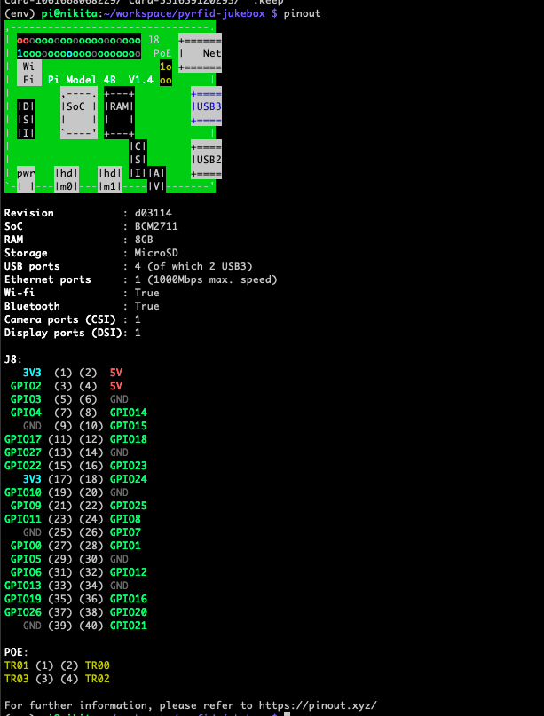

# PyRFID Jukebox

## What does this tool do?

## Getting Started

### Setting up the Raspberry Pi Zero W for the Project

### 1. Initial Configuration

- Flash a fresh copy of Raspberry Pi OS (Debian-based) onto a microSD card.
  - I've used the one without the desktop.
  - Using [Raspberry Pi Imager](https://www.raspberrypi.com/software/) allows the setup of SSH

### 2. Deb Package Installations

```bash
sudo apt-get -y update
sudo apt-get -y upgrade
sudo xargs -a docs/packages_list.txt apt install
sudo apt purge pulseaudio*
sudo reboot now
sudo apt-get install -y git vim tmux
```

** The step to remove `pulseaudio` might not be necessary (as it might not be installed by the [packages_list.txt](docs/packages_list))

### 3. Bluetooth Configuration

- Add user `pi` to the `lp` group for Bluetooth permissions:

  ```bash
  sudo usermod -a -G lp pi
  sudo usermod -aG pulse,pulse-access pi
  ```

- Once installed, follow these next steps to pair with your Bluetooth keyboard:

  1. Run the Bluetooth program by typing `bluetoothctl`.

  2. Turn on the Bluetooth, if not already on, by typing `power on`.

  3. Enter device discovery mode with `scan on` command if device is not yet listed in devices.

  4. Turn the agent on with `agent on`.

  5. Enter `pair <MAC Address>` to do the pairing between devices.

  6. You may be prompted to enter a passcode on the Bluetooth keyboard; if so, type this on the keyboard and press enter.

  7. You will need to add the device to a list of trusted devices with `trust <MAC Address>`.

  8. Finally, connect to your device with `connect <MAC Address>`.

  Note: For a list of Bluetooth commands type `help` in the command line.

### 4. SSH Configuration for Stability

- Backup the SSH configuration:

  ```bash
  sudo cp /etc/ssh/sshd_config /etc/ssh/sshd_config.backup
  ```

- Edit the SSH configuration:

  ```bash
  sudo nano /etc/ssh/sshd_config
  ```

- Add the following line to prevent SSH from becoming nonresponsive:

  ```txt
  IPQoS cs0 cs0
  ```

- Restart the SSH service to apply changes:

  ```bash
  sudo service ssh restart
  ```

### 5. Establishing SSH Connection Using Keys

1. On your **local machine**, generate an SSH key pair:

   ```bash
   ssh-keygen
   ```

2. Copy the public key to the Raspberry Pi:

   ```bash
   ssh-copy-id pi@<RaspberryPi_IP_Address>
   ```

3. Now you can SSH into your Raspberry Pi without entering a password.

### 6. BlueALSA

**A few notes for context.**

- Raspbian installs with PulseAudio. However it wasn't the easiest to get working. This is partially because it is setup to run by a non-root user
- BlueALSA is not bundled with Bullseye (Raspbian 11)

1. `git clone git@github.com:arkq/bluez-alsa.git`
2. Follow the [instructions](https://github.com/arkq/bluez-alsa/blob/master/INSTALL.md)
3. `configure` was run with the flags `--enable-systemd` and `--enable-manpages`
4. Enable the `bluealsa` service on startup via `sudo systemctl enable bluealsa`
5. Confirm it is configured with `sudo systemctl is-enabled bluealsa`

### 7. Setup the loopback

1. Edit the Modules Configuration File `etc/modules`

    ```bash
    sudo vi /etc/modules
    ```

2. Add a line at the end of the file with snd-aloop. The file should look something like this:

    ```bash

    # /etc/modules: kernel modules to load at boot time.
    #
    # This file contains the names of kernel modules that should be loaded
    # at boot time, one per line. Lines beginning with "#" are ignored.

    snd-aloop
    ```

3. Reboot your Raspberry Pi to apply the changes.

### 7. Configure CMUS to use BlueALSA

1. Get the current bluetooth device from `bluealsa-aplay -L`
2. In `~/.config/cmus/autosave` update the following values

    ```txt
      set dsp.alsa.device=bluealsa:DEV=FC:58:FA:8C:E3:A8,PROFILE=a2dp,SRV=org.bluealsa
      set output_plugin=alsa
    ```

### 8. Bluetooth Auto-connect on Reboot

To automatically establish a Bluetooth connection on reboot, the script named [`btconnect.sh`](system/scripts/btconnect.sh) is present in the home directory.

### 9. Enable RDIF

- Enable SPI Interface:
  - The SPI interface must be enabled on your Raspberry Pi for the mfrc522 module to communicate with the RFID reader. You can enable SPI using the raspi-config tool. Run sudo raspi-config, navigate to "Interfacing Options" > "SPI" and enable it. After enabling, reboot your Raspberry Pi.
- Check SPI Device Files:
  - After enabling SPI, check if the SPI device files exist. You should find device files like /dev/spidev0.0 or /dev/spidev0.1.You can check this by running ls /dev/spi* in the terminal.

### 10. PCB buildout

Due to the noisy buttons, the following schematics of the R-C circuit connect the buttons to the Raspberry PI. The schematics were created using [circuit-diagram](https://www.circuit-diagram.org)


The required parts are

- 5 push buttons
- 5 100nF capacitors (for button bouncing)
- 5 10kΩ resistors (for the pull-down resistor)
- 5 1kΩ resistors (to protect the Raspberry Pi board)

### 11. Project setup

- Install virtual env
  - `sudo apt-get install python3-venv`
- Create a venv
  - `python -m venv env`
- Activate venv
  - `source env/bin/activate`
- Install the `requirements.txt`
  - `pip3 install -r requirements.txt`

- Dump requirements
  - `pip3 freeze > requirements.txt`

## GPIO config

### RP4 Pinout



#### RP4 - Connections for the SDA, SCK, MOSI, MISO, RST of the MFRC522

- SDA (Serial Data) connected to GPIO8 (CE0) - Pin 24
- SCK (Serial Clock) connected to GPIO11 (SCLK) - Pin 23
- MOSI (Master Out Slave In) connected to GPIO10 (MOSI) - Pin 19
- MISO (Master In Slave Out) connected to GPIO9 (MISO) - Pin 21
- RST (Reset) connected to any GPIO (e.g., GPIO25) - Pin 22

#### RP4 - Additional buttons

- Play/Pause Button: Connected to GPIO17 - Pin 11
- Next Track Button: Connected to GPIO27 - Pin 13
- LED connected to GPIO22 - Pin 15
- All are connected to the GND - Pin 14

### RP0 Pinout


#### Pi Zero - Connections for the SDA, SCK, MOSI, MISO, RST of the MFRC522

- SDA (Serial Data) connected to GPIO8 (CE0) - Pin 24
- SCK (Serial Clock) connected to GPIO11 (SCLK) - Pin 23
- MOSI (Master Out Slave In) connected to GPIO10 (MOSI) - Pin 19
- MISO (Master In Slave Out) connected to GPIO9 (MISO) - Pin 21
- RST (Reset) can be connected to any available GPIO. For consistency, you can still connect it to GPIO25, but ensure it doesn't interfere with other devices or functions.

#### Pi Zero - Additional buttons

- Play/Pause Button: Connected to GPIO17 - Pin 11
- Next Track Button: Connected to GPIO27 - Pin 13
- LED connected to GPIO22 - Pin 15
- All buttons and the LED should have their other side connected to GND - Pin 9 or 14 (or any other available GND pin).

## Other helper commands config

1. `supervisord` helpers

    ```bash
    sudo supervisorctl reread
    sudo supervisorctl update

    sudo supervisorctl start btconnect
    sudo supervisorctl stop btconnect
    sudo supervisorctl restart btconnect
    sudo supervisorctl status btconnect
    ```

2. `cmus`/`screen`  helpers
    - Switch to the `cmus` screen

        ```bash
        screen -r cmus
        ```

    - Kill the `cmus` screen

        ```bash
        screen -S cmus -X quit
        ```

    - Disable `mpris` by setting the key in `~/.config/cmus/autosave` to `false`.
