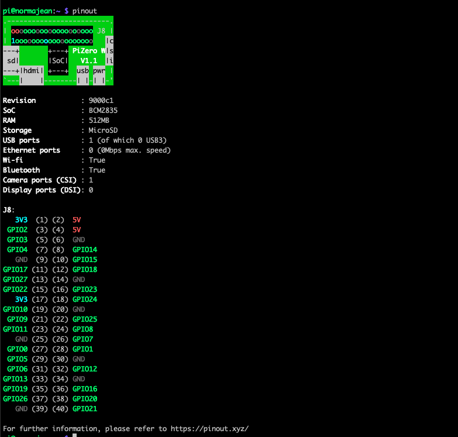

# PyRFID Jukebox

## What does this tool do?

This project is all about creating a user-friendly, RFID-based music player specifically designed for young children. Using a Raspberry Pi as its brain, the `pyrfid-jukebox` simplifies music playback to a simple action of scanning an RFID tag, thus making it accessible and engaging for little ones.


### Key Features of the Codebase

- RFID Integration: Code to interface RFID readers with the Raspberry Pi for tag scanning and playback initiation.
- Music Playback Control: Scripts to manage music playback using CMUS and ALSA for a smooth audio experience.
- Hardware Interaction: Code for handling physical inputs like buttons for play/pause, volume control, and more.
- LED Feedback System: Scripts to provide visual feedback through LEDs, enhancing the interaction for kids.
- Parental Control Module: Remote management capabilities allowing updates and maintenance via SSH or a web interface.
- Resilient Design: Focus on error handling and robustness suitable for a child-operated device.

This repository serves as a resource for developers and hobbyists interested in creating interactive, child-friendly tech solutions. Whether you're looking to replicate the project, contribute, or draw inspiration for your own creation, I hope the `pyrfid-jukebox` codebase provides valuable insights into blending technology with playful learning.

Feel free to explore, fork, and contribute to making music more accessible and fun for your little ones!

## Getting Started

### Setting up the Raspberry Pi Zero W for the Project

### 1. Initial Configuration

- Flash a fresh copy of Raspberry Pi OS (Debian-based) onto a microSD card.
  - I've used the one without the desktop. At the time of writing this, the install was Raspberry Pi OS Lite 32 Bit (64 bit was hanging)
  - Using [Raspberry Pi Imager](https://www.raspberrypi.com/software/) allows the setup of SSH

### 2. Deb Package Installations

```bash
sudo apt-get -y update
sudo apt-get -y upgrade
sudo xargs -a docs/packages_list.txt apt install
sudo apt purge pulseaudio*
sudo reboot now
```

When it boots back up...

```bash
sudo apt-get install -y git vim tmux
```

** The step to remove `pulseaudio` might not be necessary (as it might not be installed by the [packages_list.txt](docs/packages_list))

### 3. Clone project setup

- Git clone this project
  - `mkdir /home/pi/workspace/`
  - `git clone https://github.com/aaronromeo/pyrfid-jukebox`

### 3. Bluetooth Configuration

- Add user `pi` to the `lp` group for Bluetooth permissions:

  ```bash
  sudo usermod -a -G lp pi
  sudo groupadd pulse
  sudo groupadd pulse-access
  sudo usermod -aG pulse,pulse-access pi
  ```

Verify the groups with

```text
$ groups pi
pi : pi adm lp dialout cdrom sudo audio video plugdev games users input render netdev spi i2c gpio pulse pulse-access
```

Reboot the system (`sudo reboot now`)

- Once installed, follow these next steps to pair with your Bluetooth KEYBOARD:

  1. Run the Bluetooth program by typing `bluetoothctl`.

  2. Turn on the Bluetooth, if not already on, by typing `power on`.

  3. Enter device discovery mode with `scan on` command if device is not yet listed in devices.

  4. Turn the agent on with `agent on`.

  5. Enter `pair <MAC Address>` to do the pairing between devices.

  6. You may be prompted to enter a passcode on the Bluetooth keyboard; if so, type this on the keyboard and press enter.

  7. You will need to add the device to a list of trusted devices with `trust <MAC Address>`.

  8. Finally, connect to your device with `connect <MAC Address>`.

  Note: For a list of Bluetooth commands type `help` in the command line.

### 4. SSH Configuration for Stability

- Backup the SSH configuration:

  ```bash
  sudo cp /etc/ssh/sshd_config /etc/ssh/sshd_config.backup
  ```

- Edit the SSH configuration:

  ```bash
  sudo vi /etc/ssh/sshd_config
  ```

- Add the following line to prevent SSH from becoming non-responsive:

  ```txt
  IPQoS cs0 cs0
  ```

- Restart the SSH service to apply changes:

  ```bash
  sudo service ssh restart
  ```

### 5. Establishing SSH Connection Using Keys

1. On your **local machine**, generate an SSH key pair:

   ```bash
   ssh-keygen
   ```

2. Copy the public key to the Raspberry Pi:

   ```bash
   ssh-copy-id pi@<RaspberryPi_IP_Address>
   ```

3. Now you can SSH into your Raspberry Pi without entering a password.

### 6. BlueALSA

**A few notes for context.**

- Raspbian installs with PulseAudio. However it wasn't the easiest to get working. This is partially because it is setup to run by a non-root user
- BlueALSA is not bundled with Bullseye (Raspbian 11)

- `sudo apt-get update`
- `sudo apt-get install -y autoconf automake libtool`
- `git clone https://github.com/arkq/bluez-alsa.git`
- `cd bluez-alsa/`
- Follow the [instructions](https://github.com/arkq/bluez-alsa/blob/master/INSTALL.md)
  - At the time of writing this it is
    - `autoreconf --install`
    - `sudo apt-get install -y libasound2-dev libbluetooth-dev libglib2.0-dev libsbc-dev python3-docutils libdbus-1-dev`
    - `./configure --enable-systemd --enable-manpages`
    - `sudo make install`
    - `sudo adduser --system --group --no-create-home bluealsa`
    - `sudo adduser --system --group --no-create-home bluealsa-aplay`
    - `sudo adduser bluealsa-aplay audio`
    - `sudo systemctl daemon-reload`
- Enable the `bluealsa` service on startup via `sudo systemctl enable bluealsa`
- Confirm it is configured with `sudo systemctl is-enabled bluealsa`

### 7. Setup Watchdog Timer

Enable the Watchdog Kernel Module:

1. Enable the BCM2708 (or BCM2835 on newer models) watchdog kernel module. Edit `sudo vi /boot/firmware/config.txt` and add the following line at the end of the file

    ```csharp
    dtparam=watchdog=on
    ```

2. Load the watchdog kernel module

    ```bash
    sudo modprobe bcm2835_wdt
    ```

3. Ensure the module is loaded on boot, add the following line to `/etc/modules`

    ```text
    bcm2835_wdt
    ```

4. Install the watchdog daemon:

    ```bash
    sudo apt-get update
    sudo apt-get -y install watchdog
    ```

5. Configure the watchdog daemon by editing `/etc/watchdog.conf` and uncomment or add these lines. The `max-load-1` option is an example to reboot if the system load average for the last minute exceeds 24. Adjust this according to your needs.

    ```javascript
    watchdog-device = /dev/watchdog
    max-load-1 = 24
    ```

6. Start the Watchdog Service

    ```bash
    sudo systemctl enable watchdog
    sudo systemctl start watchdog
    ```

### 8. ALSA Configuration for Bluetooth Audio

To enable and configure ALSA (Advanced Linux Sound Architecture) for Bluetooth audio output, the following steps should be taken

1. `sudo apt-get install alsa-ucm-conf`

1. Copy the `system/home/.asoundrc` configuration file to the `pi` home directory.

2. Edit the file and make sure to replace "88:C6:26:23:95:3F" with the MAC address of your Bluetooth audio device.

3. To apply the changes made in the .asoundrc file, ALSA needs to be restarted. This can be done by restarting your Raspberry Pi or by reloading the ALSA configuration. To reload ALSA, use the following command:

    ```bash

    sudo alsactl restore
    ```

    If this doesn't work try `sudo reboot`

### 9. Configure CMUS to use BlueALSA

1. `sudo apt-get install -y cmus cmus-plugin-ffmpeg`
1. Get the current bluetooth device from `bluealsa-aplay -L`
2. In `~/.config/cmus/autosave` update the following values (and correct the bluetooth device name)

    ```txt
      set dsp.alsa.device=bluealsa:DEV=FC:58:FA:8C:E3:A8,PROFILE=a2dp,SRV=org.bluealsa
      set output_plugin=alsa
    ```

### 10. Bluetooth Auto-connect on Reboot

To automatically establish a Bluetooth connection on reboot, the script named [`btconnect.sh`](system/scripts/btconnect.sh) is present in the home directory.

### 11. Enable RDIF

- Enable SPI Interface:
  - The SPI interface must be enabled on your Raspberry Pi for the mfrc522 module to communicate with the RFID reader. You can enable SPI using the `raspi-config` tool. Run `sudo raspi-config`, navigate to "Interfacing Options" > "SPI" and enable it. After enabling, reboot your Raspberry Pi.
- Check SPI Device Files:
  - After enabling SPI, check if the SPI device files exist. You should find device files like /dev/spidev0.0 or /dev/spidev0.1.You can check this by running ls /dev/spi* in the terminal.

### 12. PCB buildout

Due to the noisy buttons, the following schematics of the R-C circuit connect the buttons to the Raspberry PI. The schematics were created using [circuit-diagram](https://www.circuit-diagram.org)


The required parts are

- 5 push buttons
- 5 100nF capacitors (for button bouncing)
- 5 10kΩ resistors (for the pull-down resistor)
- 5 1kΩ resistors (to protect the Raspberry Pi board)


### 13. Project setup

- Install virtual env
  - `sudo apt-get install python3-venv python3-pip`
- Create a venv
  - `python -m venv env`
- Activate venv
  - `source env/bin/activate`
- Install the `requirements.txt`
  - `pip3 install -r requirements.txt`

- Dump requirements
  - `pip3 freeze > requirements.txt`

### 14. Disable power management on the lan

Run this!

```bash
sudo iwconfig wlan0 power off
```

### 15. Install scripts

- Update the device ID <https://github.com/aaronromeo/pyrfid-jukebox/blob/main/system/scripts/btconnect.sh#L8>
- `sudo apt-get install -y supervisor screen lsof`
- Run `setup.sh`

## GPIO config

### RP4 Pinout


#### RP4 - Connections for the SDA, SCK, MOSI, MISO, RST of the MFRC522

- SDA (Serial Data) connected to GPIO8 (CE0) - Pin 24
- SCK (Serial Clock) connected to GPIO11 (SCLK) - Pin 23
- MOSI (Master Out Slave In) connected to GPIO10 (MOSI) - Pin 19
- MISO (Master In Slave Out) connected to GPIO9 (MISO) - Pin 21
- RST (Reset) connected to any GPIO (e.g., GPIO25) - Pin 22

#### RP4 - Additional buttons

- Play/Pause Button: Connected to GPIO17 - Pin 11
- Next Track Button: Connected to GPIO27 - Pin 13
- LED connected to GPIO22 - Pin 15
- All are connected to the GND - Pin 14

### RP0 Pinout




#### Pi Zero - Connections for the SDA, SCK, MOSI, MISO, RST of the MFRC522

- SDA (Serial Data) connected to GPIO8 (CE0) - Pin 24
- SCK (Serial Clock) connected to GPIO11 (SCLK) - Pin 23
- MOSI (Master Out Slave In) connected to GPIO10 (MOSI) - Pin 19
- MISO (Master In Slave Out) connected to GPIO9 (MISO) - Pin 21
- RST (Reset) can be connected to any available GPIO. For consistency, you can still connect it to GPIO25, but ensure it doesn't interfere with other devices or functions.

#### Pi Zero - Additional buttons

- Play/Pause Button: Connected to GPIO17 - Pin 11
- Next Track Button: Connected to GPIO27 - Pin 13
- LED connected to GPIO22 - Pin 15
- All buttons and the LED should have their other side connected to GND - Pin 9 or 14 (or any other available GND pin).

## Other helper commands config

1. `supervisord` helpers

    ```bash
    sudo supervisorctl reread
    sudo supervisorctl update

    sudo supervisorctl start btconnect
    sudo supervisorctl stop btconnect
    sudo supervisorctl restart btconnect
    sudo supervisorctl status btconnect
    ```

2. `cmus`/`screen`  helpers
    - Switch to the `cmus` screen

        ```bash
        screen -r cmus
        ```

    - Kill the `cmus` screen

        ```bash
        screen -S cmus -X quit
        ```

    - Disable `mpris` by setting the key in `~/.config/cmus/autosave` to `false`.

## Notes

- ffmeg is useful fo mp3 encoding `sudo apt install -y ffmpeg`
- The i2cdetect command is used to check for any devices on the I²C bus `sudo apt install i2c-tools`
- View pins with `sudo pinout`
- Check the pins with `pinctrl` for example `pinctrl get 5`

### ALSACTL

***Purpose***: `alsactl` is a command-line utility that is part of the ALSA (Advanced Linux Sound Architecture) system. ALSA is the standard audio API of Linux used for handling sound card drivers.

***Functionality***: `alsactl` is primarily used for controlling advanced settings for sound cards and managing the ALSA sound card state. It allows users to save and load ALSA configurations and settings. Common uses of `alsactl` include:

- Saving the current state of ALSA mixer controls to a file.
- Restoring mixer settings from a file (e.g., during system startup).
- Adjusting advanced settings for sound cards.

***Typical Use Case***: `alsactl` is often used in scripts or during system initialization to set up sound levels or configurations. For example, after making changes to the .asoundrc file, you might use `alsactl` restore to apply these changes without rebooting.

### BlueALSA

***Purpose***: BlueALSA is a Bluetooth audio interface for ALSA. It acts as a bridge between ALSA, which does not natively support Bluetooth audio, and Bluetooth audio devices.

***Functionality***: BlueALSA provides the capability to use Bluetooth audio devices within the ALSA framework. It allows ALSA applications (like music players) to send and receive audio to and from Bluetooth headsets, speakers, and other Bluetooth audio devices. Key features include:

- Streaming audio from ALSA applications to Bluetooth audio devices (A2DP Sink role).
- Receiving audio from Bluetooth devices (A2DP Source role).
- Handling Bluetooth telephony audio (HFP/HSP profiles).

***Typical Use Case***: BlueALSA is used when you want to integrate Bluetooth audio devices into a Linux system that uses ALSA for sound management. It enables ALSA-based applications to interact with Bluetooth audio hardware, which they wouldn't be able to do directly.
